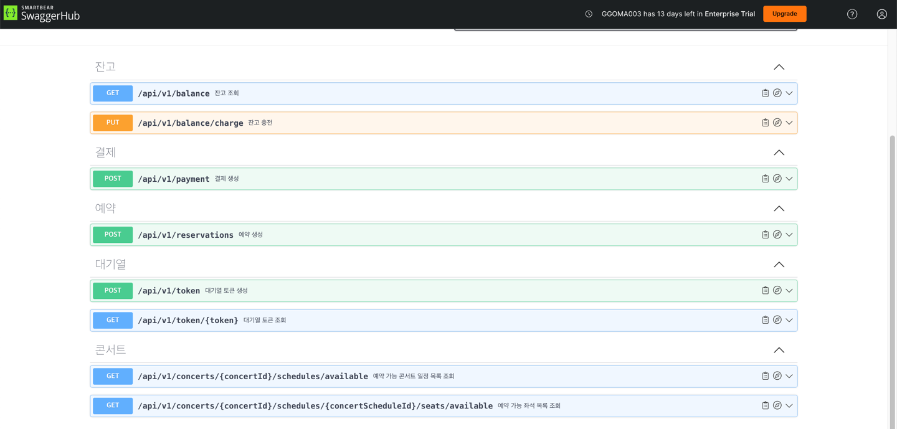
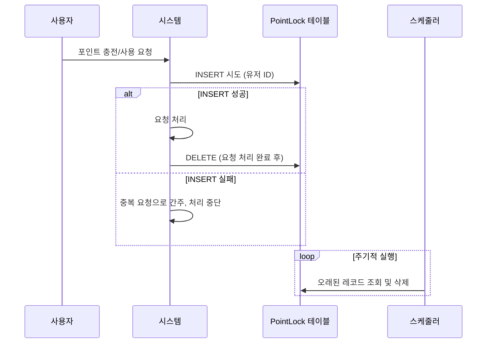

# API 명세

- [Swagger Hub](https://app.swaggerhub.com/apis-docs/GGOMA003/hhplus-concert/1.0.0)

- 문서 캡처

```mermaid
sequenceDiagram
    participant 사용자
    participant 시스템
    participant PointLock 테이블
    participant 스케줄러

    사용자->>시스템: 포인트 충전/사용 요청
    시스템->>PointLock 테이블: INSERT 시도 (유저 ID)
    alt INSERT 성공
        시스템->>시스템: 요청 처리
        시스템->>PointLock 테이블: DELETE (요청 처리 완료 후)
    else INSERT 실패
        시스템->>시스템: 중복 요청으로 간주, 처리 중단
    end

    loop 주기적 실행
        스케줄러->>PointLock 테이블: 오래된 레코드 조회 및 삭제
    end
```