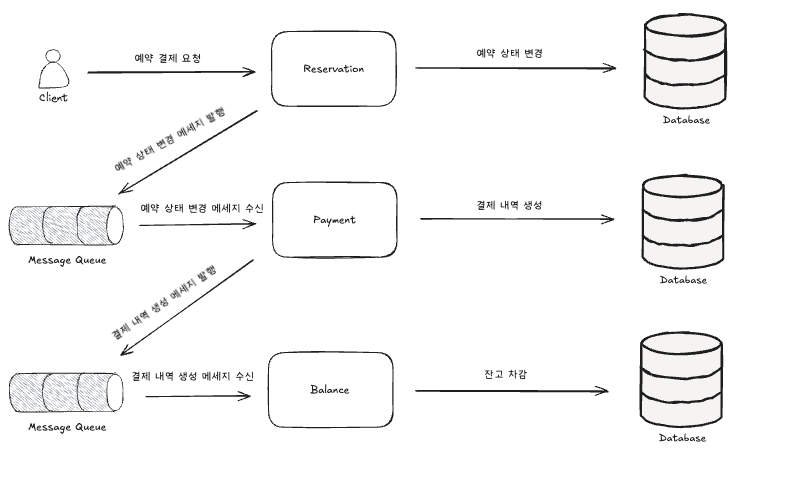
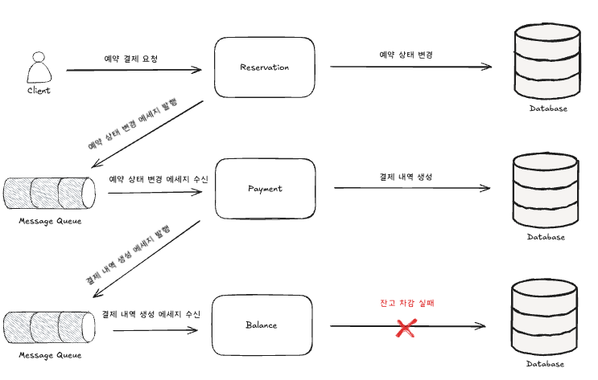
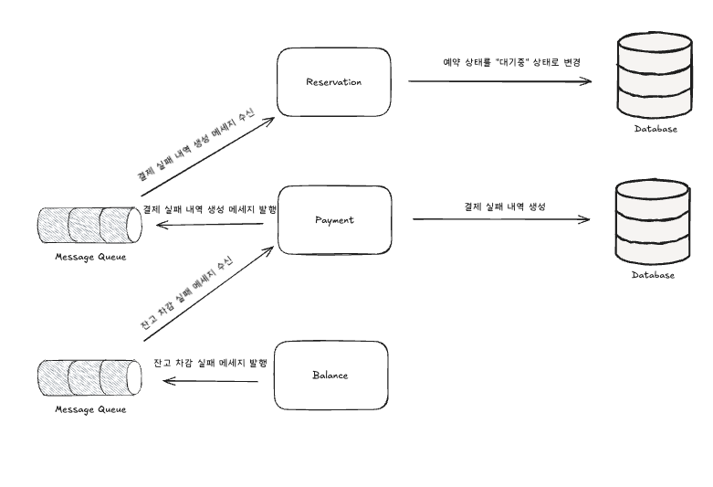

# MSA 전환 시 분산트랜잭션 처리

## MSA의 형태로 각 도메인별로 배포단위를 분리해야한다면?
보통 모놀리틱 구조에서 MSA로 전환할 경우 도메인 단위로 분리한다.  
하위 사진은 현재 콘서트 예약 서비스의 도메인 단위이며, 분리 시 하위 단위로 하나씩 서비스를 쪼개어 별도의 물리적인 마이크로 서비스로 분리하는 것이 응집도 측면에서 바람직하다고 볼 수 있다.


## MSA 전환으로 인한 트랜잭션 처리 한계
- 분산 트랜잭션 문제  
기존의 `Monolithic Architecture`에서는 하나의 데이터베이스 내에서 ACID(원자성, 일관성, 고립성, 지속성)를 보장하는 트랜잭션을 쉽게 관리할 수 있음.
하지만 MSA에서는 여러 마이크로서비스가 각각 다른 데이터베이스를 사용할 수 있으므로, 하나의 비즈니스 프로세스가 여러 서비스에 걸쳐 수행될 경우 분산 트랜잭션 문제가 발생.

- 트랜잭션 일관성 유지 어려움  
MSA 환경에서는 단일 서비스의 장애가 다른 서비스로 전파될 수 있으며, 전체 시스템의 일관성을 유지하기 어려움.
Eventually Consistency(최종적 일관성) 개념을 받아들여야 하며, 이를 위한 이벤트 소싱(Event Sourcing) 또는 CQRS(Command Query Responsibility Segregation) 등의 패턴을 고려해야 함.

- 데이터 정합성 문제    
데이터가 여러 서비스에 분산되면 즉각적인 데이터 정합성(Strong Consistency) 유지가 어려움.
비동기 메시징(Kafka, RabbitMQ)을 활용한 이벤트 기반 데이터 동기화가 필요하지만, 중복 처리 문제나 메시지 유실 문제를 해결해야 함.

- 트랜잭션 처리 성능 저하  
`Monolithic` 시스템에서는 단일 DB 트랜잭션으로 빠르게 처리할 수 있었던 작업이 MSA 환경에서는 네트워크 호출과 여러 서비스 간의 데이터 동기화를 거쳐야 함.
네트워크 오버헤드 증가, 서비스 간 호출 지연, 장애 전파 등의 문제가 발생할 수 있음.

- 트랜잭션 롤백 어려움    
`Monolithic` 시스템에서는 하나의 DB 트랜잭션 롤백으로 쉽게 복구 가능하지만, MSA에서는 각 서비스가 개별적으로 상태를 관리하므로 한 서비스에서 실패하더라도 전체 트랜잭션을 쉽게 롤백하기 어려움.
이를 해결하기 위해 보상 트랜잭션(Compensating Transaction) 개념을 활용한 Saga 패턴을 고려해야 함.

> MSA로 전환하면 트랜잭션 처리가 어려워지고, 특히 데이터 일관성과 성능 저하 문제가 발생할 수 있음. 이를 해결하기 위해서는 Saga 패턴, 이벤트 소싱, CQRS, 메시지 브로커 활용 등을 고려하여 최종적 일관성을 유지하면서도 성능을 최적화해야 함.

## 해결방안
- 대표적인 해결책:
  - 2PC (Two-Phase Commit Protocol): 데이터 일관성을 보장하지만, 네트워크 비용이 크고 성능 저하 가능성이 있음.
  - Saga 패턴
    - 보상 트랜잭션을 활용해 최종적인 일관성을 보장하지만, 복잡한 롤백 로직이 필요함.
    - 보상 트랜잭션 실행 주체에 따라서 `Choreography 방식`과 `Orchestration 방식`으로 나뉨. 


## Saga 패턴을 이용한 예약 결제 분산 트랜잭션 구현 예시

```kotlin
@Transactional
@DistributedLock(resource = LockResource.RESERVATION, key = "#reservationId", strategy = LockStrategy.REDIS_PUB_SUB)
fun payReservation(reservationId: String, token: UUID): PayReservationResult {
    예약 상태 변경()

    결제 생성()
    
    잔액 차감()

    이벤트 발행()

    // 결과 반환
}
```
현재 예약 결제 로직은 개략적으로 위 처럼 구현되어있는데, MSA로 전환하여 물리적으로 도메인 별 서비스가 분리되었다고 가정하면 더 이상 `@Transactional`을 이용하여 트랜잭션 처리를 보장할 수 없게 된다.  
이럴 경우 위에서 언급한 SAGA패턴의 일종인 `Choreography` 방식으로 분산 트랜잭션을 구현 시 아래의 흐름으로 서비스 별 트랜잭션이 실행된다. 

**예약 결제 성공 시**


쉬운 설명을 위하여 Message Queue 시스템을 이용하는 형태로 도식화 하였다.

1. 클라이언트가 예약 결제 요청을 한다.
2. 예약 서비스에서는 예약 상태를 변경하고, 예약 상태 변경 메세지를 발행한다.
3. 결제 서비스에서 예약 상태 변경 메세지를 수신하여 결제 실패 내역을 생성하고, 결제 내역 생성 메세지를 발행한다.
4. 잔고 서비스에서 결제 내역 생성 메세지를 수신하여 잔고 차감을 한다.

정상적으로 성공 시 위와 같은 흐름으로 처리. 

**예약 결제 실패 시 롤백 과정**



1. 분산 트랜잭션 처리 도중, 잔고 차감 단계에서 예상치 못한 오류로 인하여 실패
2. 잔고 서비스에서는 잔고 차감 실패 메세지를 발행한다.
3. 결제 서비스에서 잔고 차감 실패 메세지를 수신하여, 결제 실패 내역을 생성하고 결제 실패 내역 생성 메세지를 발행한다.
4. 예약 서비스에서 결제 실패 내역 생성 메세지를 수신하여, 예약의 상태를 다시 "결제 대기" 상태로 변경한다.


## Choreography 방식으로 분산 트랜잭션 구현 시 고려사항
분산 트랜잭션을 Choreography 방식으로 구현할 경우, 여러 서비스 간 이벤트 기반으로 트랜잭션을 관리해야 한다. 이 과정에서 발생할 수 있는 다양한 문제를 해결하기 위해 몇 가지 중요한 고려사항이 필요하다.

1. 메시지 유실 방지

이벤트 기반 아키텍처에서는 메시지가 손실되지 않도록 보장해야 한다. 이를 위해 다음과 같은 전략을 사용할 수 있다.

- 메시지 브로커의 내구성 보장(Durable Messaging): Kafka, RabbitMQ 같은 메시지 브로커를 사용할 때, 메시지를 디스크에 저장하여 유실을 방지한다.
- 확인 응답(Acknowledgment) 및 재시도(Retry) 정책: 메시지가 정상적으로 소비되지 않은 경우 재시도 로직을 적용하여 다시 처리할 수 있도록 한다.
- Dead Letter Queue(DLQ) 활용: 지속적으로 실패하는 메시지를 DLQ에 저장하여 나중에 별도로 처리할 수 있도록 한다.

2. 메시지 중복 발행 처리

네트워크 장애, 브로커 장애 등의 이유로 동일한 메시지가 여러 번 발행될 수 있다. 중복 메시지를 처리하는 전략은 다음과 같다.

- Idempotency Key 활용: 각 메시지에 고유한 ID를 부여하고, 동일한 ID의 메시지가 중복 처리되지 않도록 보장한다.
- 이벤트 저장소(Event Store) 활용: 발생한 이벤트를 저장하고, 중복 여부를 확인한 후 이벤트를 처리한다.
- 중복 제거 로직 적용: 메시지를 소비하는 측에서 이전에 처리된 이벤트인지 체크하는 로직을 추가한다.

3. 메시지 순서 보장

메시지가 올바른 순서로 처리되지 않으면 데이터 정합성이 깨질 수 있다. 이를 방지하기 위한 방법은 다음과 같다.

- 파티셔닝(Partitioning) 전략 적용: Kafka와 같은 메시지 브로커에서 특정 키(예: 사용자 ID, 주문 ID 등)를 기준으로 메시지를 같은 파티션에 저장하여 순서를 유지한다.
- 시퀀싱 및 버퍼링: 메시지에 타임스탬프나 시퀀스 번호를 추가하고, 순서가 맞지 않는 경우 적절히 재정렬하여 처리한다.
- 정합성 있는 소비(Transactional Consumer): Kafka의 read_committed 옵션처럼, 메시지를 순서대로 읽고 처리할 수 있도록 설정한다.
