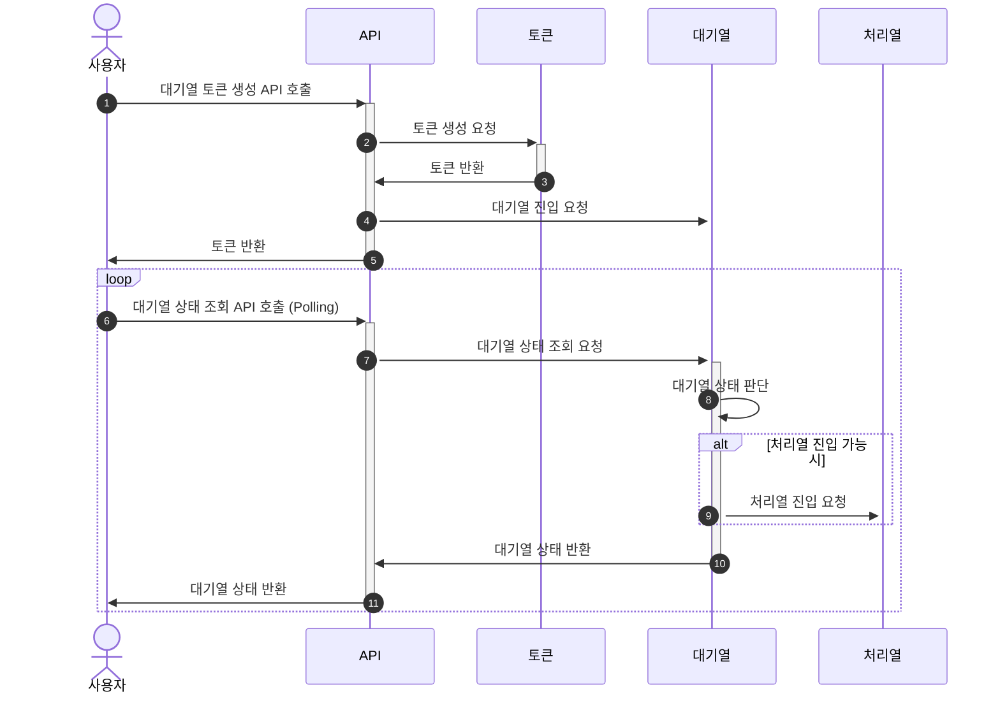
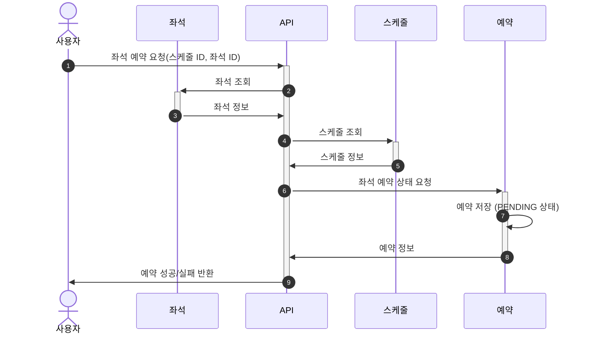
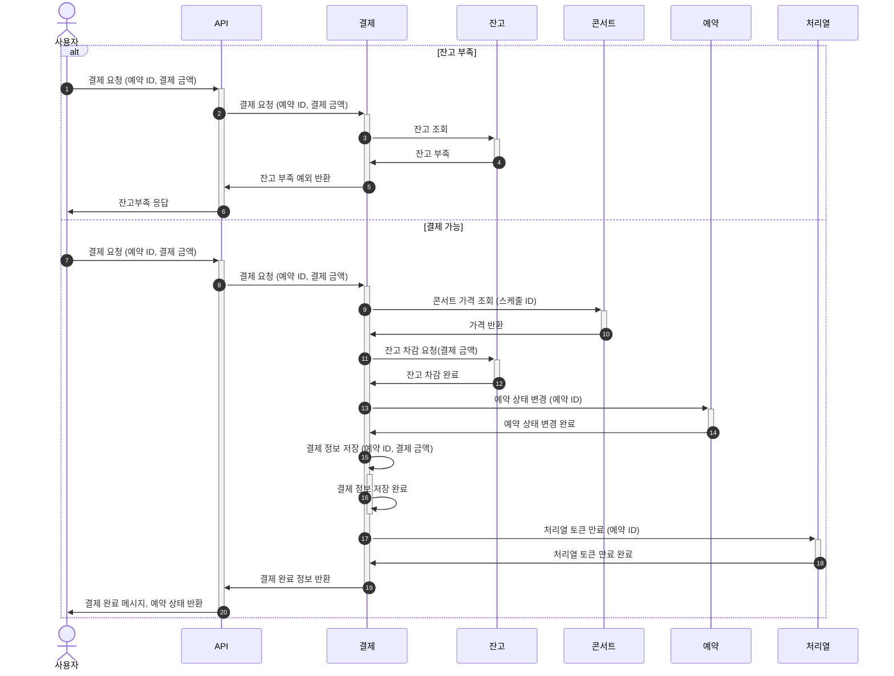

# 주요 기능 시퀀스 다이어그램

## 대기열 토큰 생성 및 처리열 진입

```mermaid
sequenceDiagram
    autonumber
    actor 사용자

    사용자->>+API: 대기열 토큰 생성 API 호출
    API->>+토큰: 토큰 생성 요청
    토큰->>-API: 토큰 반환
    API->>+대기열: 대기열 진입 요청 
    API->>-사용자: 토큰 반환
    loop
    사용자->>+API: 대기열 상태 조회 API 호출 (Polling)
    API->>+대기열: 대기열 상태 조회 요청
    대기열->>대기열: 대기열 상태 판단
    alt 처리열 진입 가능 시
        대기열->>+처리열: 처리열 진입 요청
    end
    대기열->>-API: 대기열 상태 반환
    API->>-사용자: 대기열 상태 반환
    end
```

## 좌석 예약 (처리열 토큰 검증)

```mermaid
sequenceDiagram
    autonumber
    actor 사용자
    participant 좌석

    사용자->>+API: 좌석 예약 요청(스케줄 ID, 좌석 ID)
    API->>+좌석: 좌석 조회
    좌석->>-API: 좌석 정보
    API->>+스케줄: 스케줄 조회
    스케줄->>-API: 스케줄 정보
    API->>+예약: 좌석 예약 상태 요청
    예약->>예약: 예약 저장 (PENDING 상태)
    예약->>-API: 예약 정보
    API->>-사용자: 예약 성공/실패 반환
```

## 결제 API (처리열 토큰 검증)

```mermaid
sequenceDiagram
    autonumber
    actor 사용자
    alt 잔고 부족
        사용자->>+API: 결제 요청 (예약 ID, 결제 금액)
        API->>+결제: 결제 요청 (예약 ID, 결제 금액)
        결제->>+잔고: 잔고 조회
        잔고->>-결제: 잔고 부족
        결제->>-API: 잔고 부족 예외 반환
        API->>-사용자: 잔고부족 응답
    else 결제 가능
        사용자->>+API: 결제 요청 (예약 ID, 결제 금액)
        API->>+결제: 결제 요청 (예약 ID, 결제 금액)
        결제->>+콘서트: 콘서트 가격 조회 (스케줄 ID)
        콘서트->>-결제: 가격 반환
        결제->>+잔고: 잔고 차감 요청(결제 금액)
        잔고->>-결제: 잔고 차감 완료
        결제->>+예약: 예약 상태 변경 (예약 ID)
        예약->>-결제: 예약 상태 변경 완료
        결제->>+결제: 결제 정보 저장 (예약 ID, 결제 금액)
        결제->>-결제: 결제 정보 저장 완료
        결제->>+처리열: 처리열 토큰 만료 (예약 ID)
        처리열->>-결제: 처리열 토큰 만료 완료
        결제->>-API: 결제 완료 정보 반환
        API->>-사용자: 결제 완료 메시지, 예약 상태 반환
    end
```